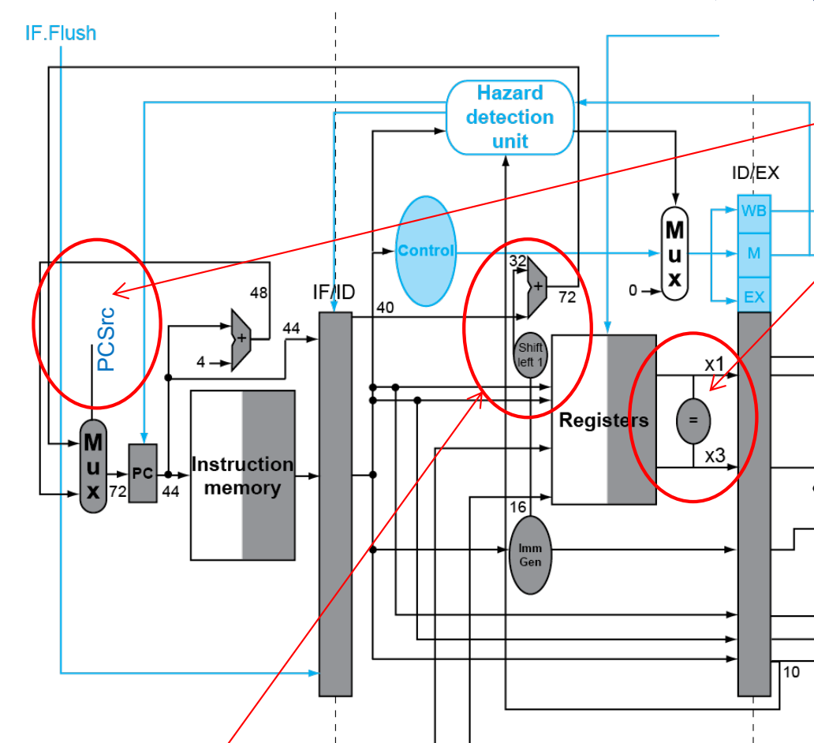
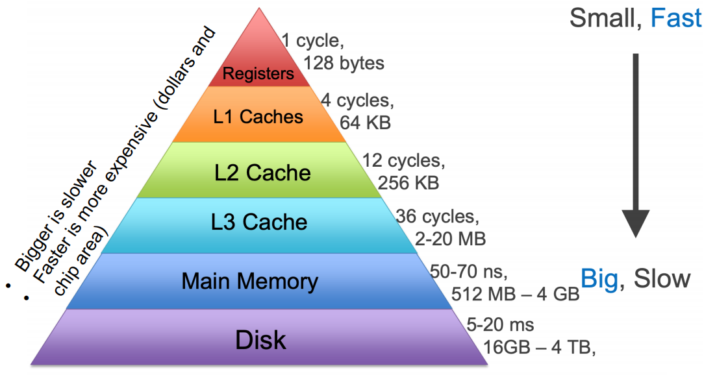
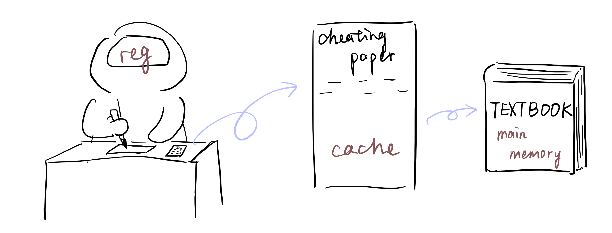
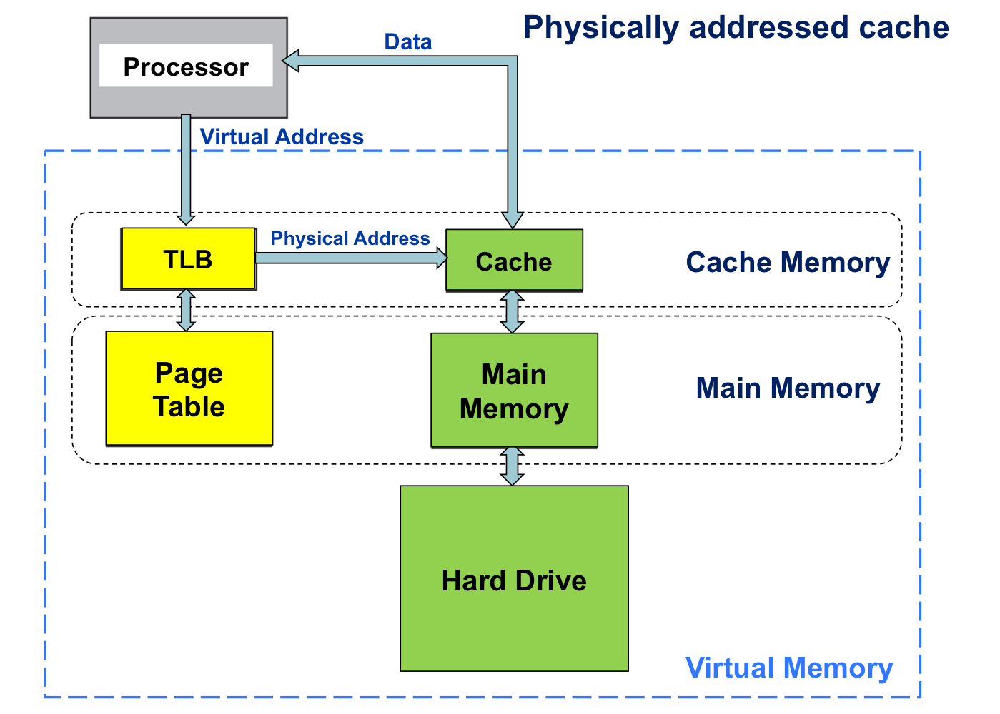
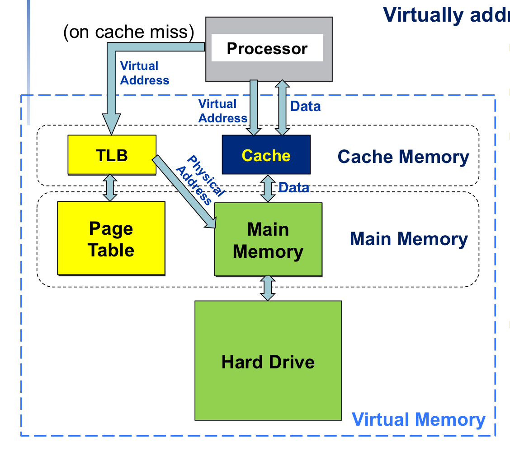
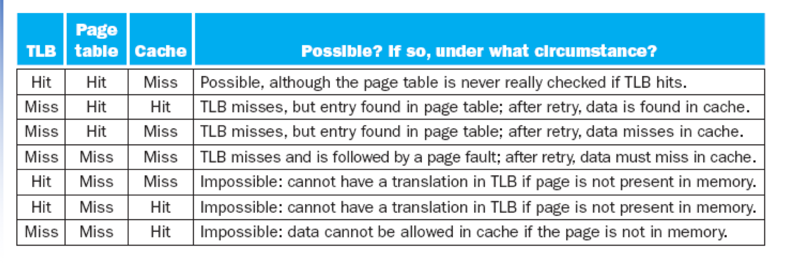
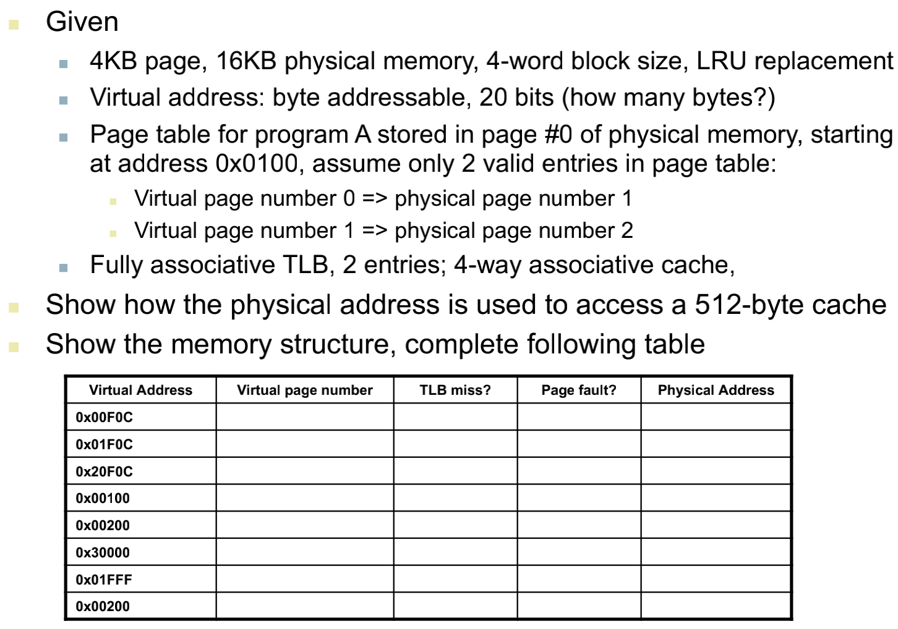

# Final Exam Review
VE370SU22 TA Runxi Wang

[TOC]

## Control Hazards

Don't forget pipeline:)

### Stall on branch

Insert nop whenever there is branch to wait until the branch target PC being calculated

### Move Branch Judgement Logic

Move from MEM stage to ID stage. We need to add some hardware in ID stage. And then only have 1 stall if we use "stall on branch" scheme. 

<p align="center">

</p>

### Always Not Taken

Assume that the branch is always not taken. Then we have chance to be correct. If it is taken, **flush** the instructions that have been loaded into the pipeline. 

If the branch decision is made in MEM stage, we need to flush 3 instructions.

If the branch decision is made in ID stage, we need to flush 1 instruction. 

Problem data hazard 1:
e.g.
```assembly
addi x5, x0, 0x34
beq x5, x6, TARGET
...
TARGET: ...
```
Solution: New forwarding path here.

Problem data hazard 2:
```assembly
lw x5, 0(x8)
beq x5, x6, TARGET
...
TARGET: ...
```
Solution: Insert nops and use forwarding path mentioned above

### Branch Predictor

- Static predictor: Based on typical branch behavior
- Dynamic predictor: Hardware (predictor) measures actual branch behavior

## Cache

### Memory Hierarchy

- Make use of locality
- Only focus on cache and main memory in this course
- Both instruction memory and data memory have this hierarchy
- Complete memory hierarchy: (We may have caches of several levels)
  
  <p>
  
  </p>

### Locality

<p>

</p>

- Temporal locality: Items that are accessed recently are likely to be accessed again soon (Knowledge you used in your last lecture)
- Spatial locality: Items near those that are accessed recently are like to be accessed soon (Knowledge used in the same chapter)

### Access Memory Hierarchy

#### Hit & Miss

- **Hit**: Accessed data present in upper level (e.g. hit in cache)
- **Miss**: Accessed data is absent. And then we need to spend more time to fetch data from a lower level
- **Hit time**: time to determine whether a hit or miss + time to pass the requested block to requestor. For miss cases, we need addtional miss panelty
- **Hit rate**: hits/accesses; Miss rate: 1 - hit rate

#### Direct Mapped Cache

- Each memory location corresponds to one choice in cache. 
- Check the valid bit of the indexed entry and compare the tag to locate a block

**Cache index**: lower log2(number of block) bits of block address   
**Tag**: bits of block address excluding cache index. 

e.g. Given a 8-bit **byte** address ``0x45`` and a cache with 4 blocks (4 words in each block), please figure out its cache index, tag, word offset, byte offset, word number, block number. 

Hint: 01_00_01_01

#### Set Associative Cache

- A set can contain n blocks with the same set index -> Called n-way assocative (special cases: 1-way-direct mapped; all blocks are in 1 set-fully associative)
- Need to compare all tags to locate a specific block

**Set index**: lower log2(number of set) bits of block address   
**Tag**: bits excluding log2(number of set) bits of block address

#### Memory Write Handling

- **Write through**: Write the data to main memory once it is updated in cache
- **Write back**: Write the data back to main memory only when the block in cache is needed to be eliminated and is written by processors previously ("dirty")
- **Write allocate**: Allocate cache block on miss by fetching corresponding memory block. Then modify the cache block and main memory block
- **No write allocate**: Write directly to main memory and then fetch the block to cache

#### Replacement Policy

**Least Recently Used (LRU)**
For set associative scheme, useless for direct mapped

- Choose the one unused for the longest time
- Need a tracking mechanism for usage. But will be more complex for higher level associative

**Random replacement** is also useful

### Cache Performance


For multi-level cache:
CPI = base CPI + L-1 miss L-2 hit (cycles per instruction) + L-1 miss L-2 miss (cycles per instruction)

Both Dmem and Imem should be considered:

CPI = base CPI + Imem miss cycles per instruction + Dmem miss cycles per instruction

Miss cycles per instruction = Portion of memory access instruction * miss rate * miss panelty

## Virtual Memory

### VM Terminology

- In virtual memory context, the data transfer unit is **page** (larger than a block)
- We use **page offset** to locate each byte in a page
- **Page table** is used for translating **virtual page number(VPN)** into **physical page number(PPN)**. And we can use VPN as an index to locate corresponding PPN.
- **Page fault**: The requested page does not exist in the main memory, we need to go to disk to fetch it. 


### Virtual Address Translation

1. Given a N-bit virtual address
2. Calculate virtual page number for it: higher log2(page size) bits of virtual address
3. Take the virtual page number as index, looking at page table, and fetch PT[index] as the physical page number
4. Physical page offset is just the virtual page offset
5. Combine physical page number of physical page offset and we obtain the physical address

### Translation Look-aside Buffer

- "Cache" of page table
- 1 translation per entry
- Full associativity
- Arrangement
    | valid | dirty | reference | tag | physical page number |
    |-|-|-|-|-|
    | 1 bit | 1 bit | 1 bit | just VPN | |

    *Reference bit: Set 1 for every access on that entry (It will be cleared by some module in a certain frequency)  
    *Dirty bit: Set 1 if the memory data correspond to this physical address is modified
- LRU or random replacement scheme
- Difference between page table: Regard virtual page number as tag but not index to locate an entry

#### Hit & Miss in TLB

- TLB hit: The requested physical page number is in TLB -> Requested data is in main memory
- TLB miss: The requested physical page number is not in TLB -> Requested data **may** be in main memory, access the page table
    - Located in page table: Load the requested page table entry to TLB
    - Page fault: The page is not in the main memory -> OS handles fetching the page from the disk and updating page table and TLB

#### Handle TLB Miss

- If there is still available place in TLB, just fetch an entry from page table
- If TLB is full, replace a TLB entry. Remember to copy back reference bit and dirty bit back to page table. 


#### Usage of TLB

1. Check valid bit field and compare virtual page number with tag field to locate the entry we want in TLB
2. If TLB hit, then we fetch the physical page number in the entry and combine it with the page offset. If TLB miss, change this situation by the steps mentioned above, and then fetch the physical page number to calculate the physical address. 

#### Relationships in Memory Hierarchy

- Physically addressed cache
  
<p align="center">

</p>

- Virtually addressed cache

<p align="center">

</p>

<p align="center">

</p>

### Example

<p align="center">

</p>

## Tips

1. Go through lecture slides for all the basic concepts (Why xxx is needed? pros and cons of xxx?)
2. Be careful about the virtual address translation questions, once one blank is wrong in the middle, your whole answer maybe be wrong TAT

<p align="center">

</p>


## Reference

[1] VE370SU22 slides T8-T13