# Midterm Review
VE370SU22 TA Runxi Wang


[TOC]

## Assembly

### Syntax
- Make use of "RISC-V Reference Data.pdf"
- Get familiar with each type of instruction 
  
    R-type: ``and rd, rs1, rs2``   
    I-type: ``ori rd, rs1, imm``, ``lw rd, imm(rs1)``  
    S-type: ``sw r2, imm(rs1)``  
    B-type: ``blt rs1, rs2, TARGET_LABEL``  
    U-type: ``lui rd, imm``  
    J-type: ``jal x1, imm`` , ``jalr x0, 0(x1)``

- Don't mistake the positions of ``rs1`` and ``rs2``

### Memory Arrangement

- Byte addressable memory (remember we have instructions like <code>lb, sb</code>)
- 4 bytes = 1 word
- So word address is a multiple of 4 (including data and instruction memory) !!!
- Big/Little endian: Remember the definition! Big endian is that most-significant byte is at the smallest address and little endian is opposite to that.  

    Example of big endian arrangement data in memory: Suppose we have data 0x12345678 and 0xAABBCCDD. 

    |  | 0xfffe_0004 | 0xfffe_0005 | 0xfffe_0006 | 0xfffe_0007 |   
    |--|-|-|-|-| 
    0xfffe_0004 | 12 | 34 | 56 | 78 |    

    | | 0xfffe_0008 | 0xfffe_0009 | 0xfffe_000a | 0xfffe_000b |   
    |--|-|-|-|-| 
    0xfffe_0008 | AA | BB | CC | DD

- How an instruction access the data memory  
  
  Read: ``lw``, ``lb``, ``lbu``, ``lh``, ``lhu``     
  e.g. Use the memory arrangement above, suppose ``x5`` stores 0xfffe_0004, 

  ```assembly
    lw x6, 4(x5)
    lb x7, 1(x5)
  ```

    After it is executed, ``x6`` == 0xAABBCCDD, ``x7`` == 0x00000034 (What if we use ``lbu`` here?)

### Stack Usage

- Data arrangement here is like that in the data memory (4 bytes=1 word)
- We use stack pointer (``sp``) to reserve stack space, access data in stack, and release stack space  

    e.g.
    ```assembly
        addi sp, sp, -20 # means we reserve 5-word space in the stack
        sw x1, 0(sp) # we store important data into it first 
        sw x10, 4(sp) 
        sw x11, 8(sp)
        ...
        lw x1, 0(sp) # after finishing some code execution, we load them back
        lw x10, 4(sp) 
        lw x11, 8(sp)
        ...
        addi, sp, sp, 20 # means we release the 5-word space
    ```

### Program Counter (PC) Usage

- Instruction memory has the similar arrangement to that of data memory
- So ``PC`` is always a multiple of 4

### Function Call

- Leaf/Non-leaf function: Non-leaf function means the function that does not call (<code>jal</code>) other functions and leaf function is the opposite case. 
- For Non-leaf function, you need to store ``x1``, argument registers (e.g. ``x10``)... in the stack. For leaf function, take care of saved registers. 

- Translate c program to assembly. Please go through all the examples in the course slides and your assignment, especially for recursion and loops:)
  
    Small exercise: Assume the function declaration for ``g`` is ``int g(int a, int b)``
    ```c
        int f(int a, int b, int c, int d) {
            return g(g(a, b), c+d);
        }
    ```

    Solution:
    ```assembly
        f: 
        addi x2, x2, -8 // Allocate stack space for 2 words
        sw x1, 0(x2) // Save return address
        add x5, x12, x13 // x5 = c+d
        sw x5, 4(x2) // Save c+d on the stack
        jal x1, g // Call x10 = g(a,b)
        lw x11, 4(x2) // Reload x11= c+d from the stack
        jal x1, g // Call x10 = g(g(a,b), c+d)
        lw x1, 0(x2) // Restore return address
        addi x2, x2, 8 // Restore stack pointer
        jalr x0, 0(x1)
    ```

## Instruction Encoding (Machine Code)

- Make sure that you know the syntax of each type of instructions
- Make use of "RISC-V Reference Data.pdf"
- Take care of immediate swirling
- If you still cannot understand how to do instruction encoding, you can go through my RC2 slides. There are very detailed steps for your reference:)

## Single-Cycle Processors

<p align="center">
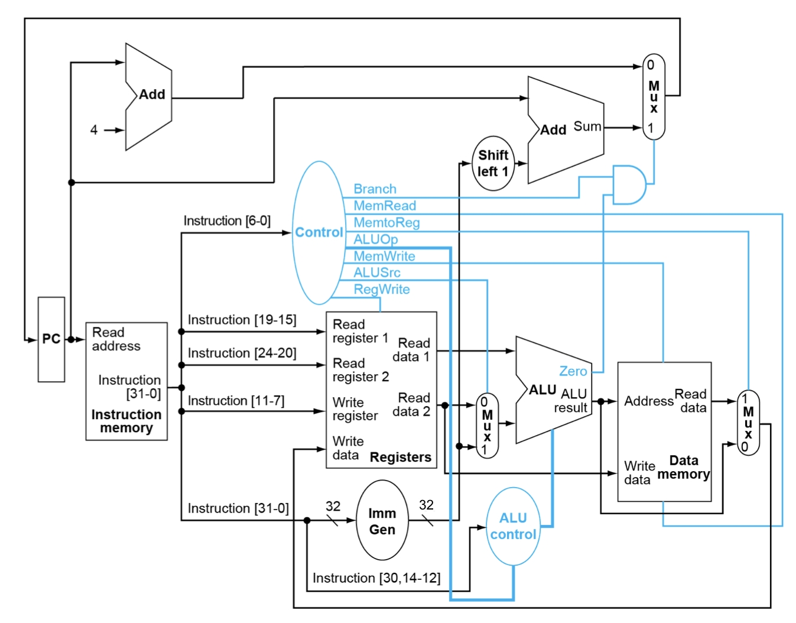
</p>

- For each instruction, know which hardware resources (blocks/modules) are used to generate what. And for each hardware resource, know how is the control signal drive it to work. 

- General execution steps
   <ol>
   <li> <code>PC</code> fetches the current instruction from instruction memory
   <li> Part of the instruction is put into Control Signal Generation Unit to produce control signal that will be used later (Don't forget ALU control)
   <li> <code>rs1</code>, <code>rs2</code> (if available), <code>rd</code> (if available) in the instruction are put as register number into register file to read or write registers respectively
    
    Part of the instruction is put into Imm Gen Unit to generate 32-bit immediate number. 
   <li> Data fetched from register file or just the immediate are put into ALU for boolean, logical, or arithmetic results (also calculate for data memory address and branch instruction compare results)

    An adder will calculate the result of to-be-branched target address with the immediate number
   <li> ALU calculated result is put as the reading/writing address of the data memory, and one data fetched from <code>[rs2]</code> is put as the write data of the data memory. 
   <li> If needed, the data feteched from data memory or calculated from ALU is writted back into register file with register number <code>rd</code>
   </ol>

    Example: how is ``sw x5, 4(x6)`` executed in the single-cycle processor?

## Performance Evaluation

### Performance Related Factors
- Algorithm
- Programming language, compiler, and architecture
- Processor and memory system
- I/O system

### CPU time
The performance we focus on here is execution time. 

CPU time = Instruction count * CPI (Average Cycles per Instruction) * Clock Cycle Time

Performance depends on 
- Algorithm: IC, possibly CPI
- Programming language: IC, CPI
- Compiler: IC, CPI
- ISA: IC, CPI

## Pipeline Processors

- 5 stages: IF, ID, EX, MEM, WB
- Execute 5 instructions at the same clock cycle in different stages (ideally)
- If no hazards happen, we execute n instructions in n+4 clock cycles. 

Example:
Suppose we have the following instructions to be processed in the pipeline structure. (You don't need to consider hazards here)
```assembly
addi x5, x0, 4
lw x6, 0(x7)
sub x28, x28, x29
sw x7, 0(x29)
```

Multi-cycle pipeline diagram

|    | C1 | C2 | C3 | C4 | C5 | C6 | C7 | C8 | C9 | 
|---|---|---|---|---|---|---|---|---|---|
addi | IF | ID | EX | MEM | WB |  |  |  
lw |  | IF | ID | EX | MEM | WB |  | 
sub | | | IF | ID | EX | MEM | WB | 
sw | | | | IF | ID | EX | MEM | WB 

Execution details   
C1:
<p align="center">
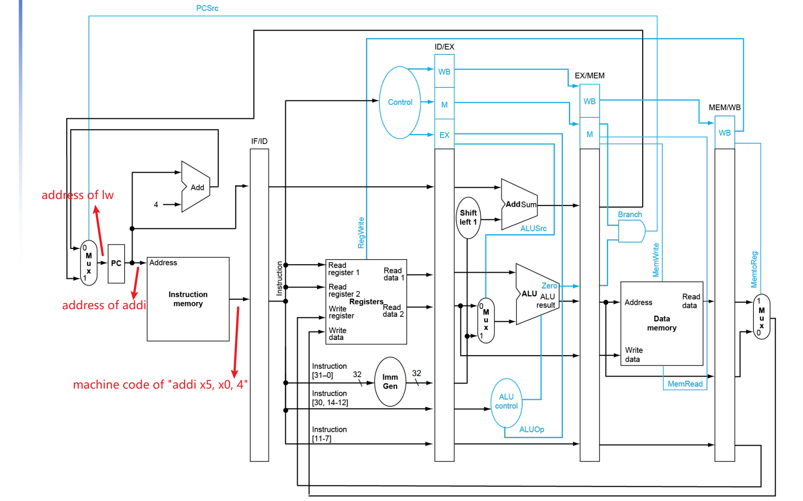
</p>

C2: 

<p align="center">
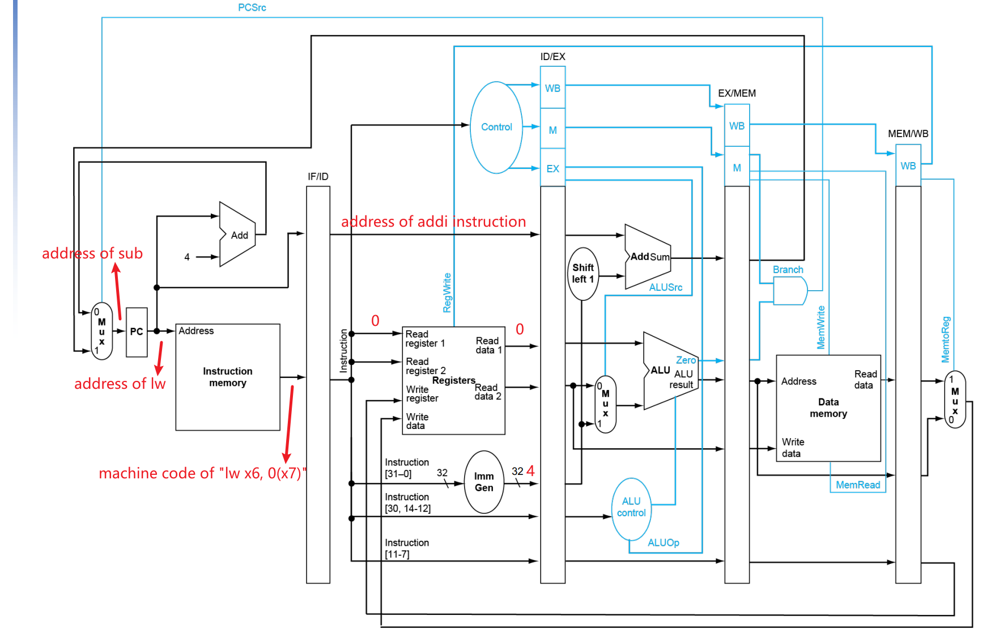
</p>

C3:
<p align="center">
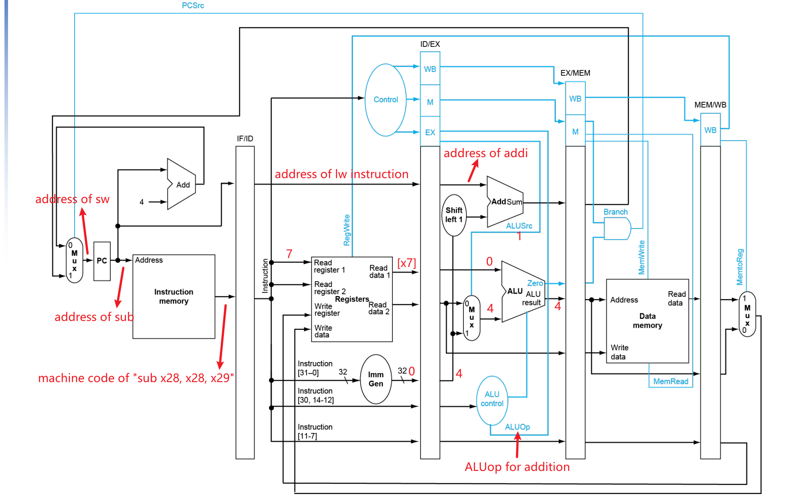
</p>

C4:
<p align="center">
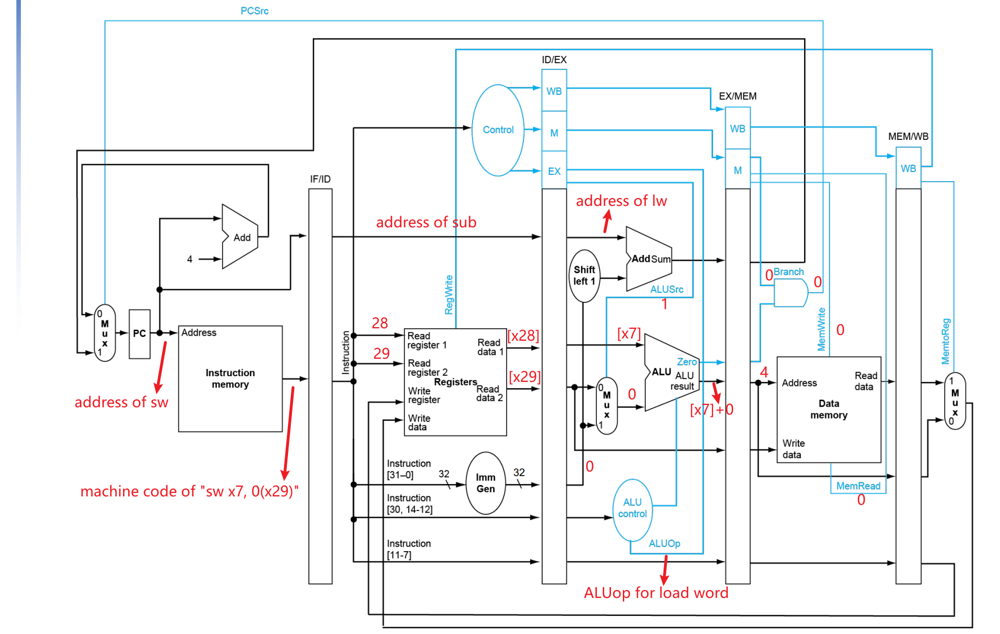
</p>

C5:
<p align="center">
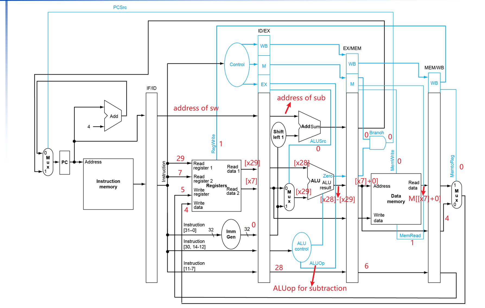
</p>

C6:
<p align="center">
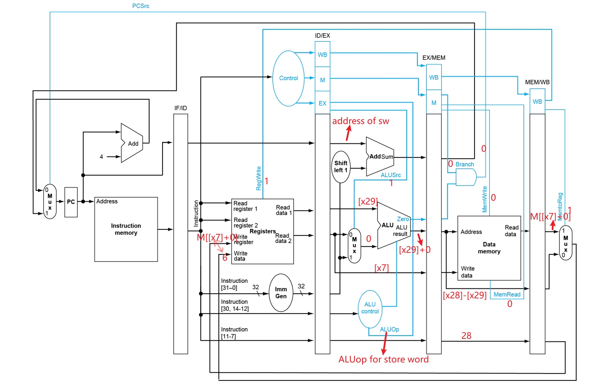
</p>

C7:
<p align="center">
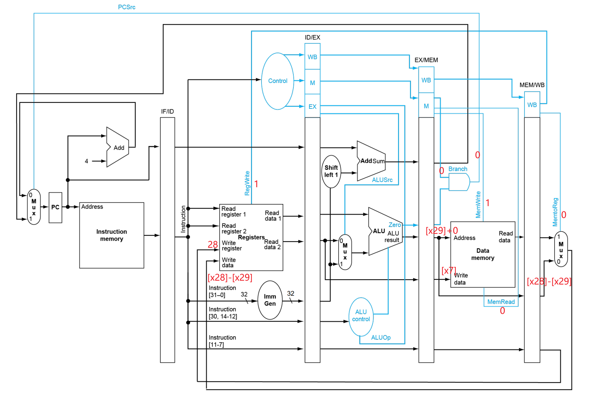
</p>

C8:
<p align="center">
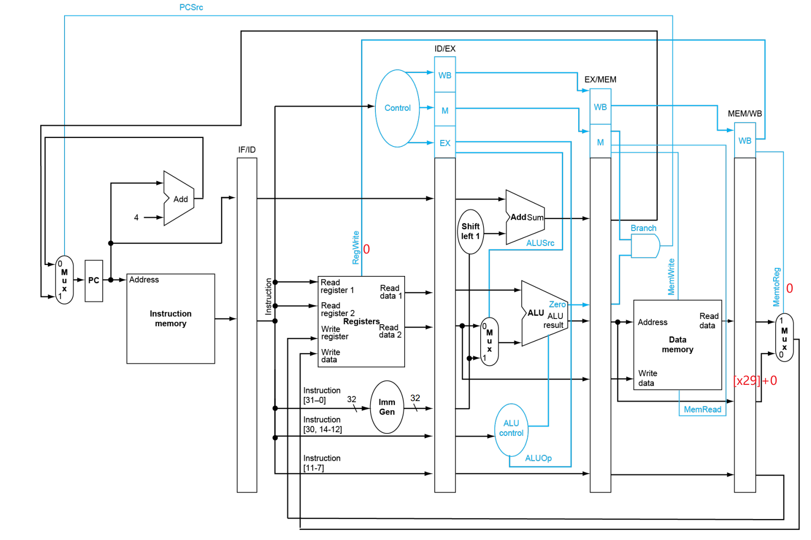
</p>

## Data Hazards

### Categories of Data Hazards

Case 1:

```assembly
add x5, x6, x5
sub x28, x5, x6
```
Draw a pipeline diagram:
|   | C1 | C2 | C3 | C4 | C5 | C6  | C7 | C8 |
|-|-|-|-|-|-|-|-|-|
add | IF | ID | EX | MEM | WB 
sub | | IF | ID | ID* | ID* | EX | MEM |WB

we need additional 2 cycles(stalls) to fetch correct data of ``x5`` and then continue to calculate ``x5-x6``. 

Case 2:

```assemble
lw x5, 0(x6)
addi x5, x5, 1
```
Draw a pipeline diagram:
|   | C1 | C2 | C3 | C4 | C5 | C6  | C7 | C8 |
|-|-|-|-|-|-|-|-|-|
lw | IF | ID | EX | MEM | WB 
addi | | IF | ID | ID* | ID* | EX | MEM |WB

we need additional 2 cycles(stalls) to fetch correct data of ``x5`` that is loaded from data memory and then do calculation for it. 

### Dealing with Data Hazards

Solution 1 - **forwarding**   
Can solve all case-1 data hazards mentioned above, but not completely for load-use data hazards.

Forward data from ``EX/MEM`` register or ``MEM/WB`` register
<p align="center">
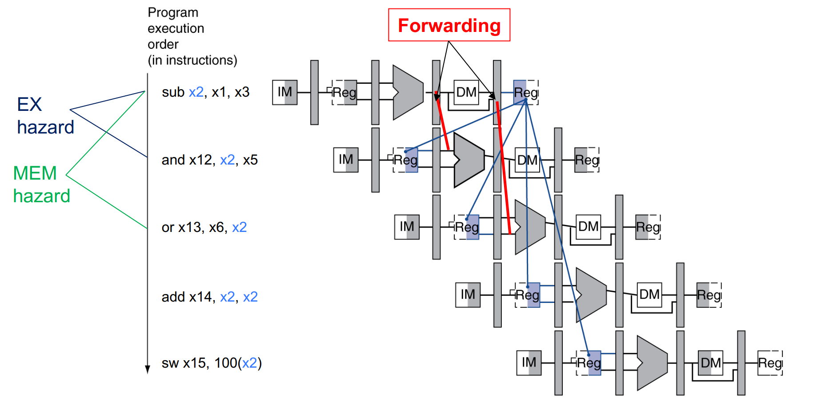
</p>

and choose the data needed for calculation
<p align="center">
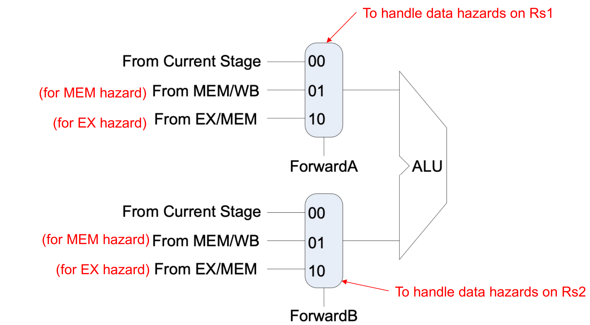
</p>

The control signal ``ForwardA`` and ``ForwardB`` is generated from **Forwarding unit**. 

Logic in Forwarding unit:

```c
if (EX/MEM.RegWrite && (EX/MEM.RegisterRd ≠ 0) && (EX/MEM.RegisterRd == ID/EX.RegisterRs1)) // EX hazard 
    ForwardA = 10
else if (MEM/WB.RegWrite && (MEM/WB.RegisterRd ≠ 0) && (MEM/WB.RegisterRd = ID/EX.RegisterRs1) // MEM hazard
    ForwardA = 01
if (EX/MEM.RegWrite && (EX/MEM.RegisterRd ≠ 0) && (EX/MEM.RegisterRd == ID/EX.RegisterRs2)) // EX hazard
    ForwardB = 10
else if (MEM/WB.RegWrite && (MEM/WB.RegisterRd ≠ 0) && (MEM/WB.RegisterRd = ID/EX.RegisterRs2) // MEM hazard
    ForwardB = 01;
```

Solution 2 - **Stall**   
For load-use data hazards, forwarding cannot fix it completely. We need to compromise some time to wait for data loaded from data memory.

<p align="center">
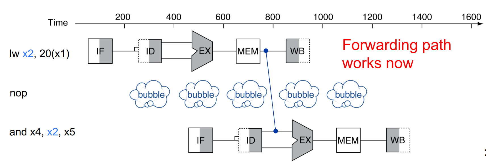
</p>

We will use a **hazard detection unit** here to detect whether we need to insert a stall.

<p align="center">
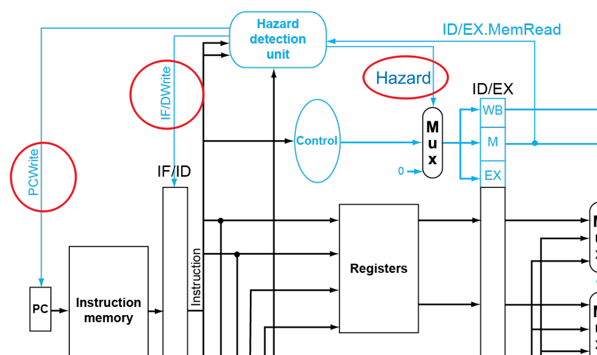
</p>

Logic in the Hazard Detection Unit
```c
    if (ID/EX.MemRead && (ID/EX.rd == IF/ID.rs1 || ID/EX.rd == IF/ID.rs2)) {
        PCWrite = 0;
        IF/IDWrite = 0;
        Hazard = 1;
    }
    else {
        PCWrite = 1;
        IF/IDWrite = 1;
        Hazard = 0;
    }
```
Logic of stalls:
- Force control signals in ``ID/EX`` stage register to be 0
- Keep the value of ``PC`` and intruction in ``ID/EX``

## Tips

**Please go through course slides in details, including any concepts and examples!!!**

**Please review your assignments and projects**

**Please also start to do your project 4, it does help for the exam!!!**

<p align="center">

</p>