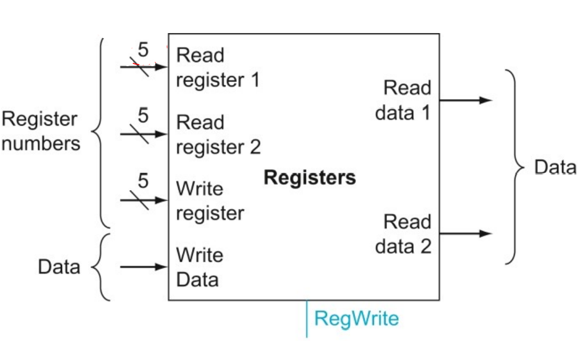

# Assembly (Slides T2-T3)
VE370SU22 TA Runxi Wang

## Brief Intro of Assembly

high level languages (e.g. ``.cpp``)  --compiler--> assembly languages (``.s``) --assembler--> machine code (``.o``) --linker--> executable machine code (``.elf``) --formatter--> machine code for a target processor (e.g. ``.exe``)

## When to Use
- Avoid uncertainties of execution time and size brought by compilers
- To speed up or reduce the size of a program
- Use with high level languages

## Shortcomings
- Can be time consuming
- No assembler optimization
- Different computers support different assemblers
- Hard to debug:(

**We will focus on RISC-V 32-bit ISA(Instruction Set Architecture) in this course!**

## Operands

### Register Operands
Register size: 32 * 32bits register file, from ``x0``, ``x1``, to ``x31``. 

<p align="center">

</p>

How is register used?  
e.g.  
c++ code:
```c++
a = b + c;
```
Assume ``b`` is put in ``x5``, ``c`` is put in ``x6``, and ``a`` is put in ``x7``. Then the corresponding assembly is 
```assembly
add x7, x5, x6
```

### Memory Operands
**Big/Little Endian**  
Definition for big endian: Most-significant byte si at the smallest address  
e.g. A word ``0x11223344``
|Endian | 0x0fff0000 | 0x0fff0001 | 0x0fff0002 | 0x0fff0003 |    
| ------- | ---------|------------|------------|-------------- |  
|Little | 44 | 33 | 22 | 11 |  
|Big | 11 | 22 | 33 | 44 |  

**Memory Organizations**  
Array arrangement   
e.g.  
| Word Address | 0x0fff1110 | 0x0fff1114 | 0x0fff1118 | 0x0fff111C |      
|---------|---------|-------|-------|-----|       
| Array (``A``) Index | 0 | 1 | 2 | 3 |
| Data Stored in ``A`` (32bit) | 0x11111111 | 0x22222222 | 0x33333333 | 0x44444444 |   

``A[2]`` corresponds to the data stored in address ``0x0fff1118``

**Load and Store**  
e.g.  
c++ code:

```c++
A[i] = B[j];
```
Assume ``i`` is in ``x5``, ``j`` is in ``x6``, base address of array ``A`` is in ``x7``, and base address of array ``B`` is in ``x28``. Then its corresponding assembly is 
```assembly
slli x5, x5, 2
add x5, x5, x7
slli x6, x6, 2
add x6, x6, x28
lw x29, 0(x6)
sw x29, 0(x5)
```

### Immediate Operands
Involves constant data, like 0, 1, 2... or -1, -2...   
Don't need to load data from memory or register file. 

A useful constant: ``x0``. Can not be overwritten and can be used to clear a register. 

e.g. ``addi``, ``slli``...

## Get Familiar with Other Operations!

### Logical
``and``, ``or``, ``slli``...   
e.g.
```assembly
and x5, x6, x7
```
Meaning: ``x5 = x6 & x7``
```assembly
slli x5, x6, 2
```
Meaning: ``x5 = x6 << 2``

### Arithmetic
``add``, ``addi``...   
(See the examples above)

### Conditional 
``beq``, ``bne``, ``blt``, ``bge``   
e.g.  
```assembly
beq x5, x6, ELSE
add x5, x0, x0
ELSE: ...
```
Meaning: If ``x5 == x6``, neglect the code in the second line and execute the code after ``ELSE:``

### Load Upper Immediate
``lui``  
e.g.   
```assembly
lui x5, 0x11111
```
Meaning: copy ``0x11111`` to bits ``[31:12]`` of register ``x5``.

### Load/Store
``sw``, ``lw``, ``lb``, ``lbu``, ``sb``...
```assembly
lb x5, 0(x6)
```
Meaning: Load the byte stored in address ``x6`` into ``x5`` and sign extend to 32 bits. 


### Jump
``jal``
```assembly
jal x1, ProcedureLabel1
```
Meaning: ``x1`` increases by 4 so that it becomes return address register. Program counter points to where the ``ProcedureLabel1`` represents. 

``jalr(jr)``
```assembly
jalr x0, offset(x1)
```
Meaning: Program counter points to where ``offset+x1`` represents (Usually the offset is 0).   
In Ripes, ``jalr`` will cause error. Please use the following instruction instead. 
```assembly
jr x1
```

## Program Counter (PC)
- A special register that points to the instruction to be executed next
- Each instruction is encoded as a 32bit word
- PC increase by 4 when go to fetch the next instruction

## Stack Pointer
Used when you need to reserve some space in stack to store the important variables  
e.g. 
```assembly
addi sp, sp, -12
...
# Several operations
...
addi sp, sp, 12
```

## Function Call

### General Steps
<ol>
<li> Before calling the function, place arguments to corresponding registers. 
<li> Jump to target function
<li> In the function, reserve space to store important variables
<li> Execute function operations
<li> Recover the changed important variables and release the reserved space
<li> Place calculation results in required registers
<li> Return to place to function call
</ol>

### Leaf Functions
- Functions that do not call other functions
- Only save **saved registers** (``x8, x9, x18-x27``)

### Non-Leaf Functions
- Functions call other functions
- Before calling other functions, make sure you save its return address (``x1``), argument registers (``x10, x11``...), and temporary registers needed after calling functions returned (``x5, x6``...)

### Function Examples
*Please try all the examples in the lecture slides by yourselves!!!

**Loop**  
c code:    
```c
int add(int *a, int size) {
    //REQUIRES: size is positive integers
    int result = 0;
    for (int i = 0; i < size; i++) {
        result = result + a[i];
    }
    return result;
}
```
Assume two arguments ``a`` and ``size`` are stored in ``x11`` and ``x12`` respectively. And the returned result is stored in ``x10``.    
assembly:
```assembly
ADD: 
    addi x10, x0, 0 # Initialize the result
    add x5, x0, x11 # Initialize the address of the first word
    addi x6, x0, 0 # Initialize the counter (i)
LOOP: 
    lw x7, 0(x5) # Load a[i]
    add x10, x10, x7
    addi x6, x6, 1 
    addi x7, x7, 4
    bne x6, x12, LOOP
    jr x1
```

**Recursion**   
c code:
```c
int fact (int n) {
    //REQUIRES: n is a positive integer
    if (n < 3) return n;
    else return n * fact(n-1);
}
```
assembly
```assembly
fact:
    addi sp, sp, -8
    sw x1, 4(sp)
    sw x10, 0(sp)
    addi x5, x10, -3
    bge x5, x0, L1 
    addi sp, sp, 8 # Why no need to restore x1 and x10?
    jr x1
L1:
    addi x10, x10, -1
    jal x1, fact
    addi x6, x10, 0 # Now what is the value stored in x10
    lw x10, 0(sp)
    lw x1, 4(sp)
    addi sp, sp, 8
    mul x10, x10, x6
    jr x1
```

## Reference

[1] VE370 SU22 Slides T2

[2] VE370 FA21 Slides T3
