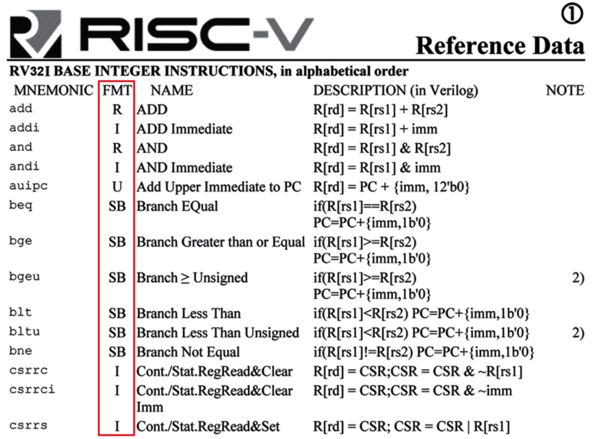
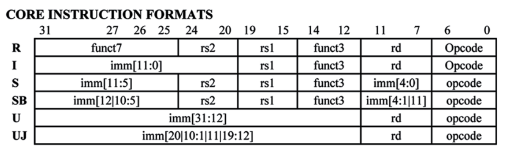
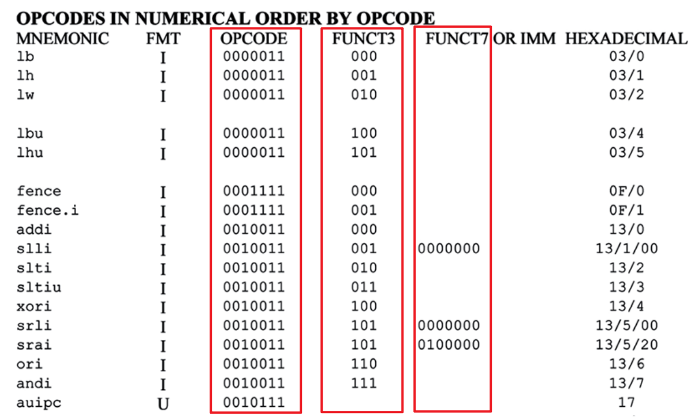
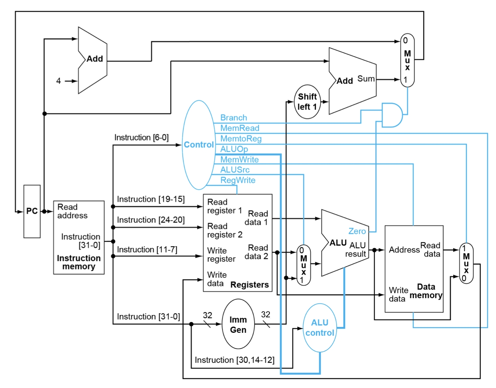
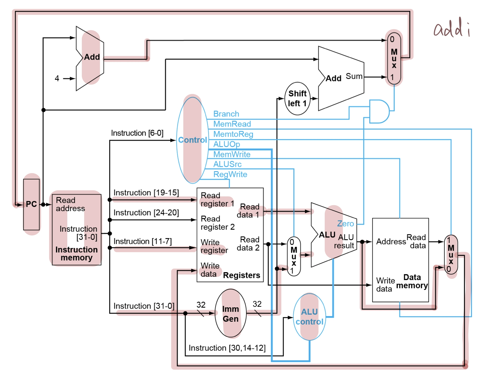

# Instruction Encoding & Single-Cycle CPU (Slides T4-T5)
VE370SU22 TA Runxi Wang

## Instructions in 32-bit RISC-V

<ul>
<li> All 32 bits long
<li> Machine code
<li> including all information of a line of instruction (e.g. add x5, x6, x7)
</ul>

## From assembly to Machine Code

**TIPS**
- Make use of "RISC-V Reference Data"
- Check instruction type 

- Check the formats of the corresponding type you found

- Check opcode, funct3 (if available), and funct7 (if available)

- Transfer register number to binary and place it to corresponding slots of the instruction format
  - Don't mistake the order of rs1, rs2, and rd
  - e.g. add rd, rs1, rs2
  - e.g. lw rd, imm(rs1)
  - e.g. sw rs2, imm(rs1)
- For immediate, pay attention to different treatments for different types
  - I-type: Just turn the immediate into binary and put it into the corresponding slots
  - B-type: imm = (Branch target label - Current PC) / 2, and notice the special placement of bits of the immediate in B-type format
  - J-type: imm = (Jump target label - Current PC) / 2, and notice the special placement of bits of the immediate in J-type format
  - S-type: pay attention the special placement of bits of the immediate in S-type format
  - U-type: pay attention the special placement of bits of the immediate in U-type format

**Why we need to swirl the immediate bits?**  
To save hardware on the critical path!

## Single-Cycle CPU

*You have to know how to code every block in the above diagram using Verilog so that you can finish project 3 :)

### Block(Resources) Usages

For every (type) of instructions, you have to know exactly which block is used to execute it.

Example. arithmetic immediate operations (use ``addi`` as an example)

### Control Signal Generation

For every (type) of instructions, after you have known exactly which block is used, it is time to assign them corresponding control signals!

Examples. 

|      | Branch | MemRead | MemtoReg | ALUOp | MemWrite | ALUSrc | RegWrite |  
-------|--------|---------|----------|-------|----------|--------|----------|  
| sub | 0 | 0 | 0 | 10 | 0 | 0 | 1 |  
| lw | 0 | 1 | 1 | 00 | 0 | 1 | 1 |  
| beq | 1 | 0 | 0 | 01 | 0 | 0 | 0 |  

## Final Tips for Project 3
- Read manual and specifications carefully
- Debug a module/block once you finish it
- Be careful about the modules that need clock signal
- Start early :)

## Reference

[1] VE370 SU22 Slides T4

[2] VE370 FA21 Slides T5
