# Pipeline Processors and Data Hazards (T6-T7)
VE370SU22 TA Runxi Wang

## From Single-Cycle to Pipeline

- Clock cycle time is shorter
- Ideally, pipeline speeds up the instruction process a lot
- But pipeline brings some hazard needed to be solved

<p align="center">
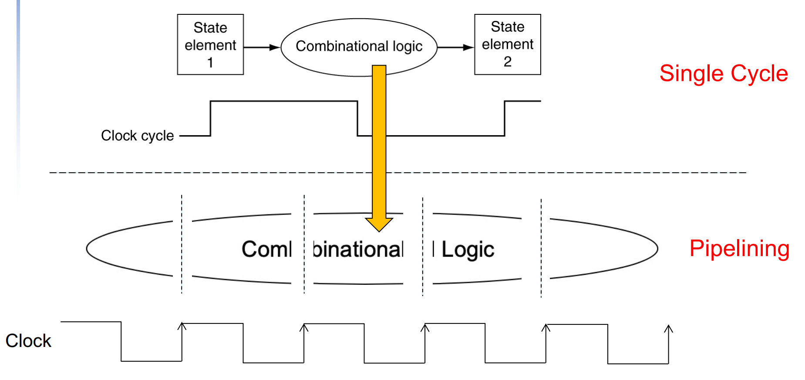
</p>

## Pipeline Processor Architecture
A general view, but not complete!
<p align="center">
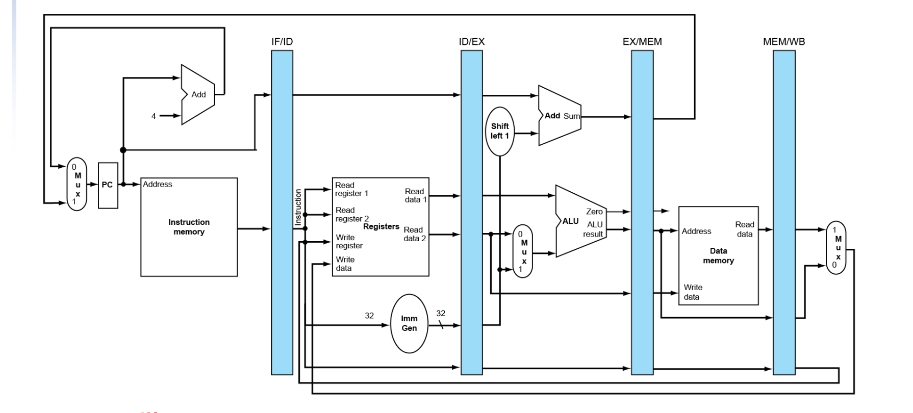
</p>

With this structure, we can 
- Execute multiple instructions (in different stages) at the same cycle
- Execute n instructions in n+4 cycles (if no stalls due to hazards/branch mispredict)

### Stages

IF: Instruction fetch. Components includes PC, instruction memory, etc.   
ID: Intruction decode. Read data from register file, generate immediate, etc.  
EX: Execution. Calculate using ALU, etc.   
MEM: Access data memory. Read or write data memory.   
WB: Write back. Write data back to register file. 

### Control signals in Pipeline Processors

- Each module should have their control signals as assigned in single-cycle processors
- Control signals will be useless after it finishes its job in corresponding stage
- Use stage registers to record control signals 
<p align="center">
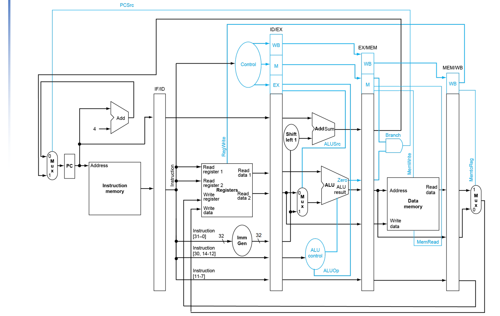
</p>

### How a Pipeline Processor Work (with example)

Suppose we have the following instructions to be processed in the pipeline structure. (You don't need to consider hazards here)
```assembly
addi x5, x0, 4
lw x6, 0(x7)
sub x28, x28, x29
sw x7, 0(x29)
```

Multi-cycle pipeline diagram

|    | C1 | C2 | C3 | C4 | C5 | C6 | C7 | C8 | C9 | 
|---|---|---|---|---|---|---|---|---|---|
addi | IF | ID | EX | MEM | WB |  |  |  
lw |  | IF | ID | EX | MEM | WB |  | 
sub | | | IF | ID | EX | MEM | WB | 
sw | | | | IF | ID | EX | MEM | WB 

Execution details   
C1:
<p align="center">
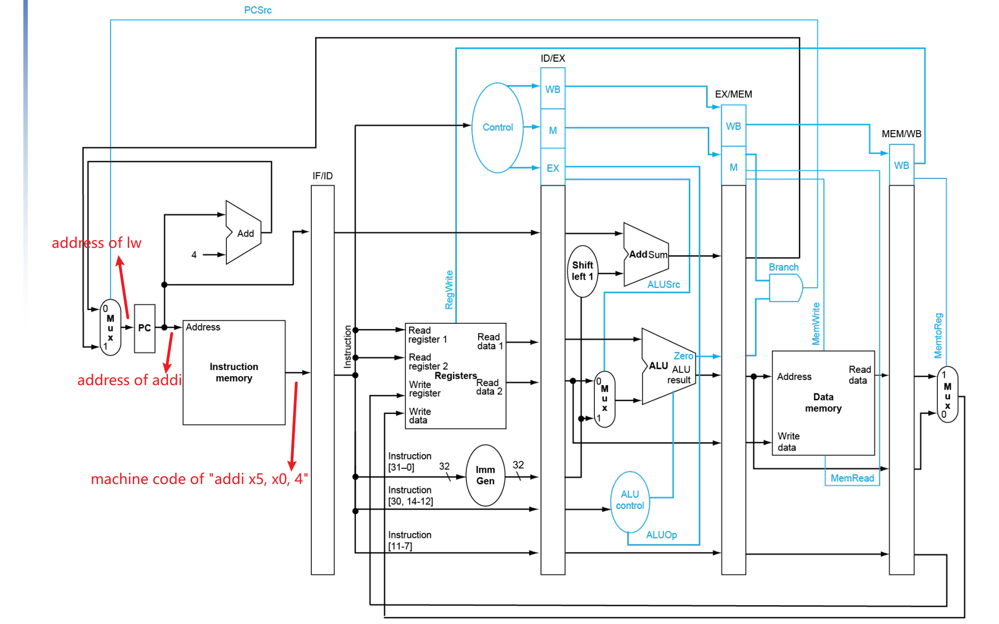
</p>

C2: 

<p align="center">
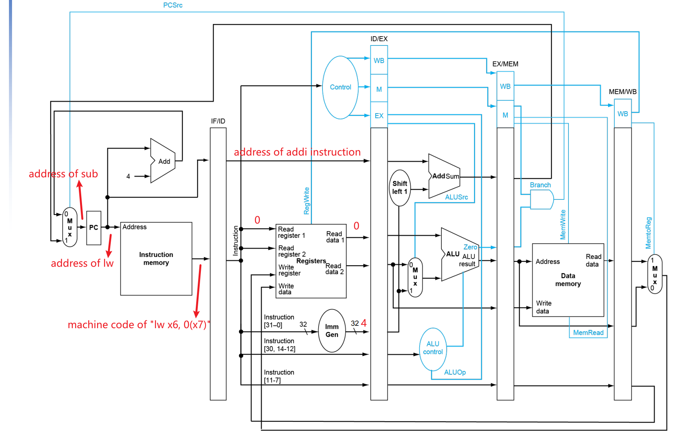
</p>

C3:
<p align="center">
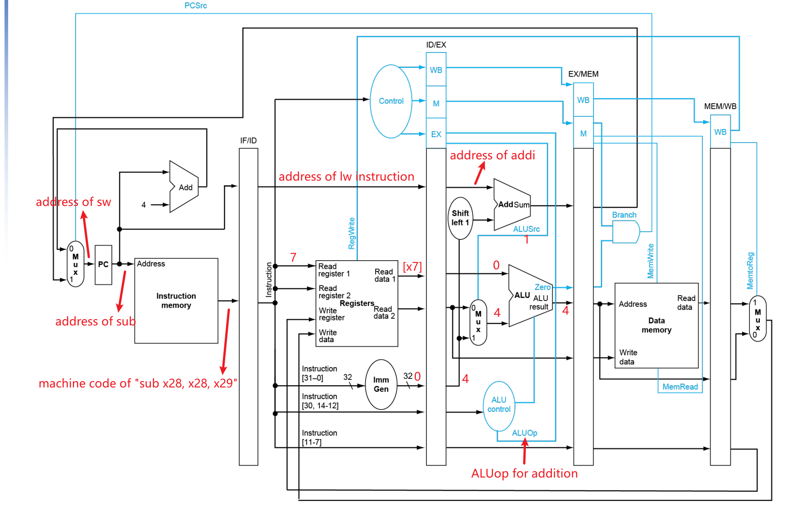
</p>

C4:
<p align="center">
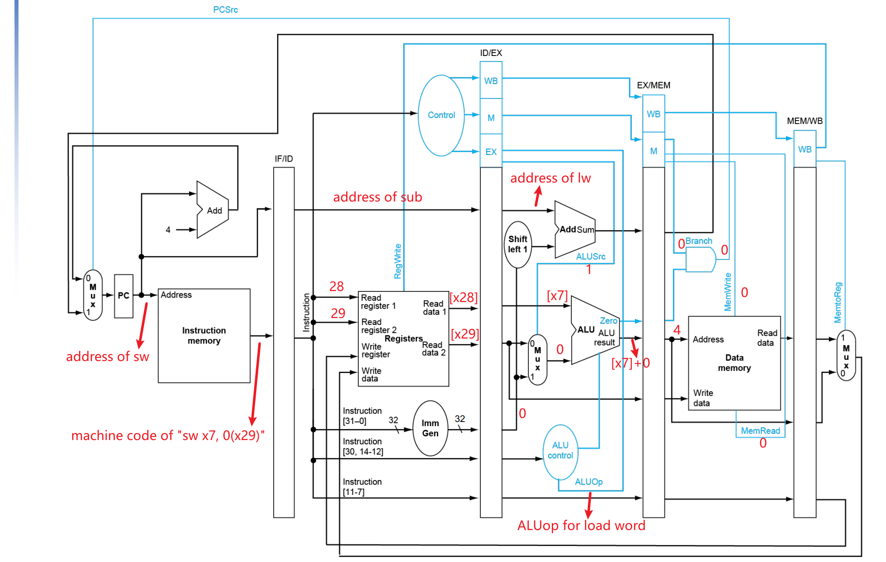
</p>

C5:
<p align="center">
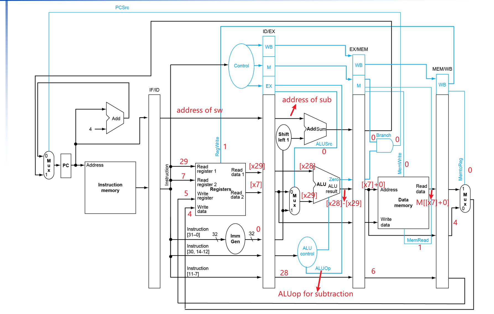
</p>

C6:
<p align="center">
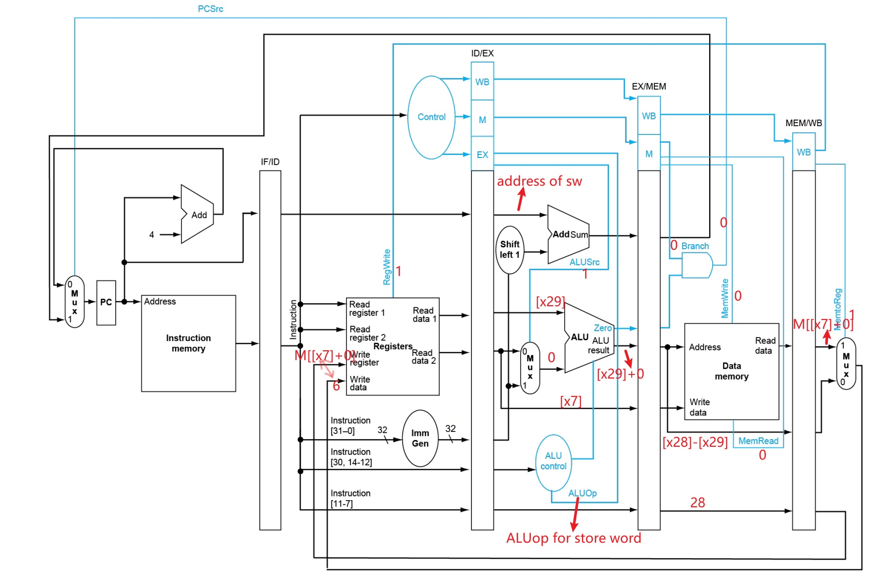
</p>

C7:
<p align="center">
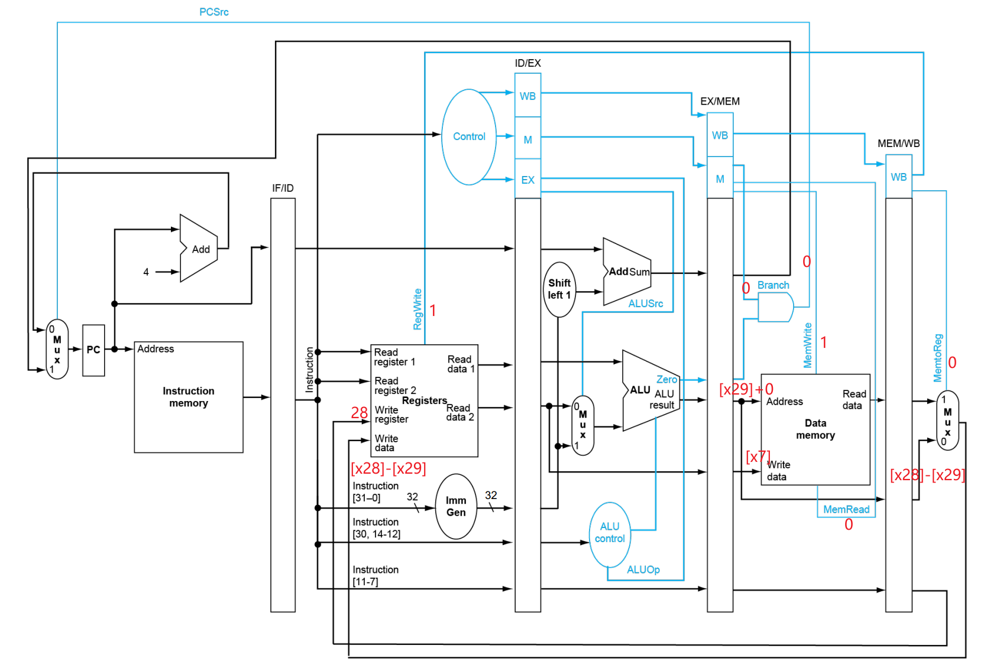
</p>

C8:
<p align="center">

</p>

## Data Hazards

**Different type of hazards**
- Data hazards: Need to wait for previous instruction to complete its data read/write
- Control hazards: Decision on control action depends on previous instruction
- Structure hazards: A required resource is busy

### Categories of Data Hazards

Case 1:

```assembly
add x5, x6, x5
sub x28, x5, x6
```
Draw a pipeline diagram:
|   | C1 | C2 | C3 | C4 | C5 | C6  | C7 | C8 |
|-|-|-|-|-|-|-|-|-|
add | IF | ID | EX | MEM | WB 
sub | | IF | ID | ID* | ID* | EX | MEM |WB

we need additional 2 cycles(stalls) to fetch correct data of ``x5`` and then continue to calculate ``x5-x6``. 

Case 2:

```assemble
lw x5, 0(x6)
addi x5, x5, 1
```
Draw a pipeline diagram:
|   | C1 | C2 | C3 | C4 | C5 | C6  | C7 | C8 |
|-|-|-|-|-|-|-|-|-|
lw | IF | ID | EX | MEM | WB 
addi | | IF | ID | ID* | ID* | EX | MEM |WB

we need additional 2 cycles(stalls) to fetch correct data of ``x5`` that is loaded from data memory and then do calculation for it. 

### Dealing with Data Hazards

Solution 1 - **forwarding**   
Can solve all case-1 data hazards mentioned above, but not completely for load-use data hazards.

Forward data from ``EX/MEM`` register or ``MEM/WB`` register
<p align="center">
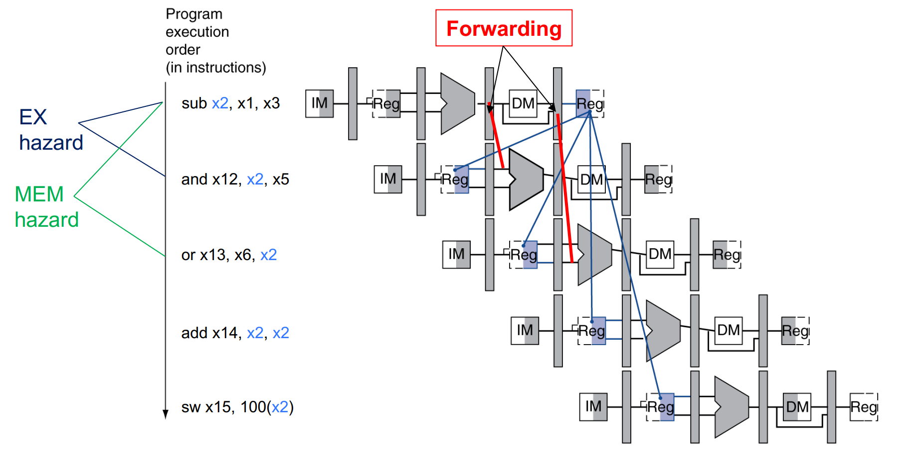
</p>

and choose the data needed for calculation
<p align="center">
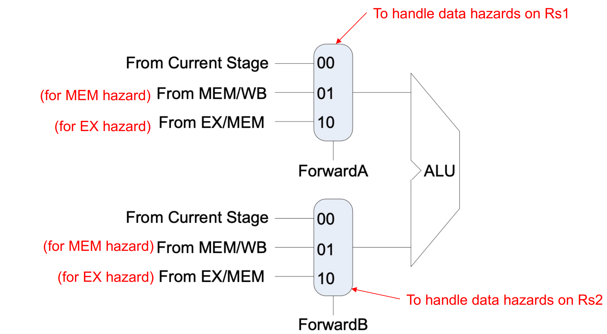
</p>

The control signal ``ForwardA`` and ``ForwardB`` is generated from **Forwarding unit**. 

Logic in Forwarding unit:

```c
if (EX/MEM.RegWrite && (EX/MEM.RegisterRd ≠ 0) && (EX/MEM.RegisterRd == ID/EX.RegisterRs1)) // EX hazard 
    ForwardA = 10
else if (MEM/WB.RegWrite && (MEM/WB.RegisterRd ≠ 0) && (MEM/WB.RegisterRd = ID/EX.RegisterRs1) // MEM hazard
    ForwardA = 01
if (EX/MEM.RegWrite && (EX/MEM.RegisterRd ≠ 0) && (EX/MEM.RegisterRd == ID/EX.RegisterRs2)) // EX hazard
    ForwardB = 10
else if (MEM/WB.RegWrite && (MEM/WB.RegisterRd ≠ 0) && (MEM/WB.RegisterRd = ID/EX.RegisterRs2) // MEM hazard
    ForwardB = 01;
```

Solution 2 - **Stall**   
For load-use data hazards, forwarding cannot fix it completely. We need to compromise some time to wait for data loaded from data memory.

<p align="center">
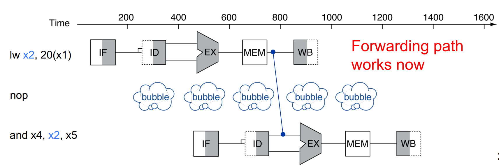
</p>

We will use a **hazard detection unit** here to detect whether we need to insert a stall.

Logic of stalls:
- Force control signals in ``ID/EX`` stage register to be 0
- Keep the value of ``PC`` and intruction in ``ID/EX``

## Tips for Project 4

(This is for those who do not know how to start it. If you have your own design, that is great!)

- Check for each instruction required in the project manual to see if it can be processed by the pipeline structure mentioned in the lecture
- Construct each module (maybe just copy/modify from P3) and debug for each module
- Check interfaces for each stage and construct your stage register
- Construct each stage and debug each of them
- Combine all stages to one and do final debug:)
- It will take much longer time if you found P3 is difficult, do start early!!!

## Reference
[1] VE370 SU22 Slides T6

[2] VE370 SU22 Slides T7