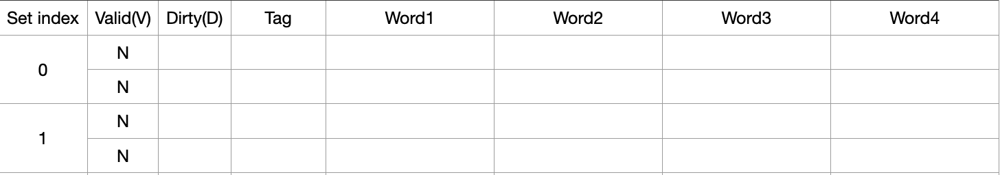
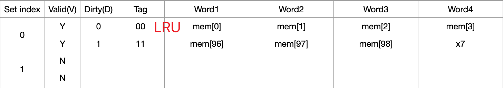

# Cache & Virtual Memory (T11-T12)
VE370SU22 TA Runxi Wang

[TOC]

## Set Associative

### Direct mapped & Set Associative & Fully Associative
<p>

</p>

- A set can contain n blocks with the same set index -> Called n-way assocative (special cases: 1-way-direct mapped; all blocks are in 1 set-fully associative)
- Calculation of **set index**: lower log2(number of set) bits of block address
- Calculation of **tag**: bits excluding log2(number of set) bits of block address
- Need to compare all tags to locate a specific block

   Example: 2K blocks in cache, 4-way associative, 8 words in each block, 32-bit byte address 0x810023FE. Show the set index and tag for this byte address. 

    Solution:    
   
   | tag | set index | word offset |  byte offset |    
   |-|-|-|-|
   | 31:14 | 13:5 | 4:2 | 1:0 |


## Replacement Policy

- Random: Randomly choose one block to be replaced by the requested block. Gives approximately the same performance as LRU for high associativity

### Least Recently Used (LRU)

For set associative scheme, useless for direct mapped

- Choose the one unused for the longest time
- Need a tracking mechanism for usage. But will be more complex for higher level associative

### Example

Assume we only have 2 sets in a cache, it is 2-way associative, 4 words per block, with 7-bit byte address, and use LRU policy. We have the following memory access request, 

```assembly
lw x5<-mem[0]
lw x6<-mem[96]
sw x7->mem[99]
lw x28<-mem[65]
```

The cache is initialized as 

<p>

</p>
For 7-bit byte address, we have 

| tag | set index | word offset | byte offset |   
|-|-|-|-|
| 6:5 | 4 | 3:2 | 1:0 |  

For each memory access, we have  

1. ``lw x5<-mem[0]`` byte address: 00_0_00_00; miss
<p>

</p>

2. ``lw x6<-mem[96]`` byte address: 11_0_00_00; miss
<p>

</p>

3. ``sw x7->mem[99]`` byte address: 11_0_00_11; hit
<p>

</p>

4. ``lw x28<-mem[65]`` byte address: 10_0_00_01; miss
<p>

</p>
<p>

</p>


## Virtual Memory Basics

### Why Virtual Memory

- Computer may have a huge program that requires memory to be much larger than cache and main memory
- Computer may run multiple programs, they may share the main memory, but we don't want them to communicate with each other
- CPU interacts with main memory through cache, but we don't want it be bothered by memory issues

### What is Virtual Memory

- An imaginary, huge and fast memory from CPU’s perspective – mapped to physical memory
- Each program has a virtual memory space
- Mapping is done by CPU or OS translating specific virtual addresses to specific physical addresses
- For both instruciton memory and data memory
- If a requested page is not in main memory, it should be fetched from **swap space** in disk (but time consuming). 

<p>

</p>

### Page & Page Table & Page Fault

- In virtual memory context, the data transfer unit is **page** (larger than a block)
- We use **page offset** to locate each byte in a page
- **Page table** is used for translating **virtual page number(VPN)** into **physical page number(PPN)**. And we can use VPN as an index to locate corresponding PPN.
- **Page fault**: The requested page does not exist in the main memory, we need to go to disk to fetch it. 
 

### Virtual Address Translation

1. Given a N-bit virtual address
2. Calculate virtual page number for it: higher log2(page size) bits of virtual address
3. Take the virtual page number as index, looking at page table, and fetch PT[index] as the physical page number
4. Physical page offset is just the virtual page offset
5. Combine physical page number of physical page offset and we obtain the physical address

### Example

<p>
  
</p>
<p>

</p>
Solution:   
<p>

</p>


## Reference

[1] VE370SU22 slides T11   
[2] VE370SU22 slides T12